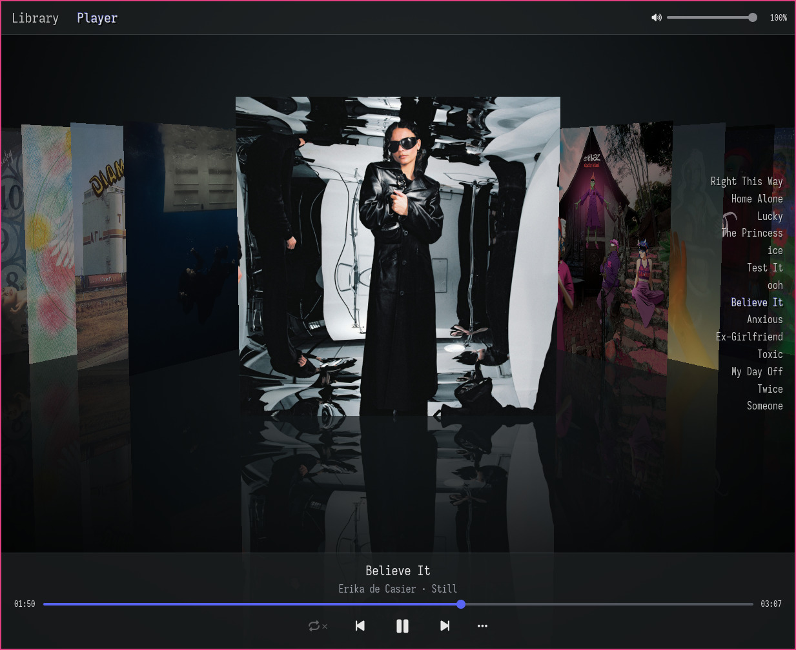

# Phonoscule

A framework for building music players, and a beautiful reference GUI application.

> **Disclaimer: nearly vibe-coded.**
> Most of this code was produced by an AI agent directed by me, the human author.
> In this project, I've focused more on the design and UX, and less on the code.
> I've tried to guide the agent towards elegant and type-safe design,
> but I haven't thoroughly reviewed all code.
> The player is working great for me,
> but I wouldn't be surprised if some bugs have *slopped* through ;)

`phonoscule` is a pure-Rust library of reusable backend pieces:
reading tags, decoding audio, seeking, sample-format conversion,
and a small source/sink plumbing layer to connect a decoder to an output.
It needs only an [embedded-io async](https://crates.io/crates/embedded-io-async) reader,
is `no_std`-friendly and light on allocation,
and is intended to be usable anywhere from a desktop GUI down to a headless microcontroller.

The repository includes a reference application called `phonoscule-gui` or eponymously *Phonoscule*.
It's a graphical music player with *Cover Flow* visuals and a focus on finding and playing albums.
See [`gui/README.md`](gui/README.md) for more details.

## The framework (`phonoscule`)

- **Tags.** Reads metadata as it parses -
  title, artist, album, album artist, genre, track/disc number, and date -
  from WAV `LIST`/`INFO` chunks and Ogg Opus (Vorbis) comments.
- **Decoding.** WAV (8/16/24/32-bit integer and 32-bit float, mono or stereo)
  and Ogg Opus, the latter via the pure-Rust
  [opuscule](https://github.com/bryal/opuscule) decoder.
- **Playback plumbing.** Sample-accurate seeking, sample-format conversion,
  and a small `Source`/`Sink` layer for wiring a decoder to whatever plays it.
- **Portable.** `no_std`-friendly and async.
  Hand it an `embedded-io` reader and it runs, desktop to microcontroller.

FLAC and Ogg Vorbis are on the roadmap, but not included as of yet.

## The reference application (`phonoscule-gui`)



A graphical, album-art-centric music player -
a lightweight native alternative to cover-grid MPD clients.
Browse a wall of covers, filter and search, and play into a Cover Flow-style now-playing view,
with desktop media integration and keyboard-driven controls.

```sh
cargo run --release -p phonoscule-gui
```

It plays through PulseAudio (and PipeWire) on Linux.
See [`gui/README.md`](gui/README.md) for its features, configuration, and controls.

## A terminal example (`phonoscule-cli`)

A small example of driving the framework -
a terminal player that takes files on the command line, with a few keyboard controls.

```sh
cargo run --release -p phonoscule-cli -- my-song.opus
```

## License

Released under the **Mozilla Public License 2.0** (see [`LICENSE`](LICENSE)).
Copyright (c) 2026 Jojo <jo@jo.zone>.
