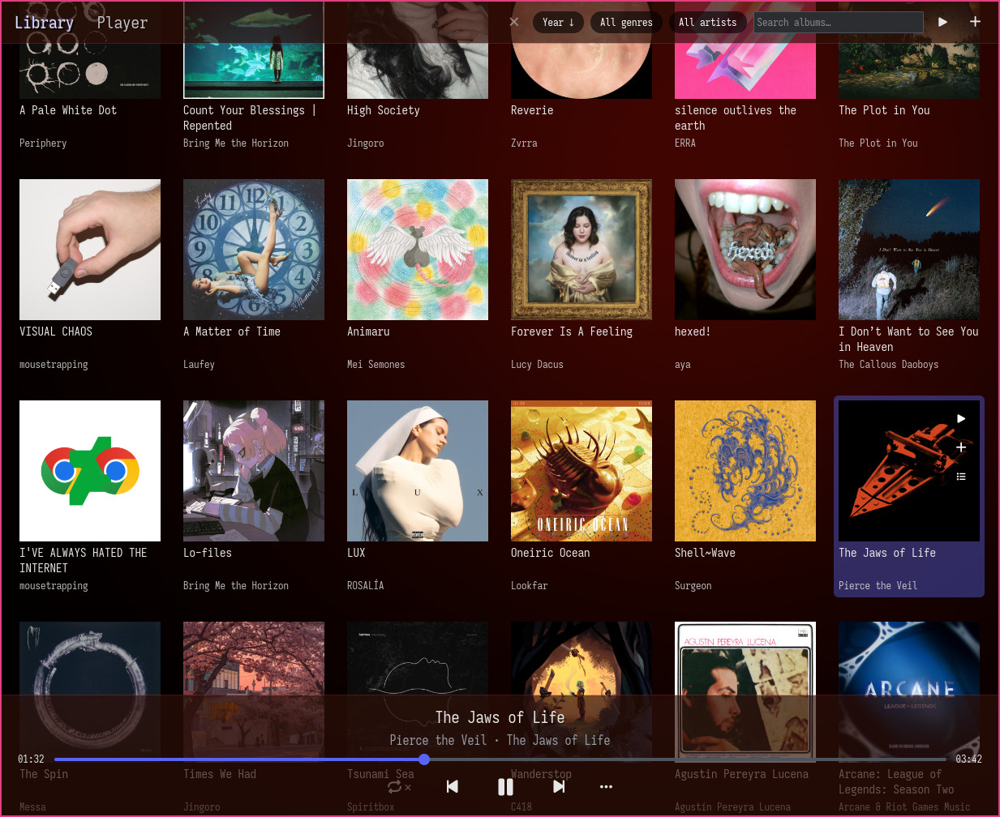
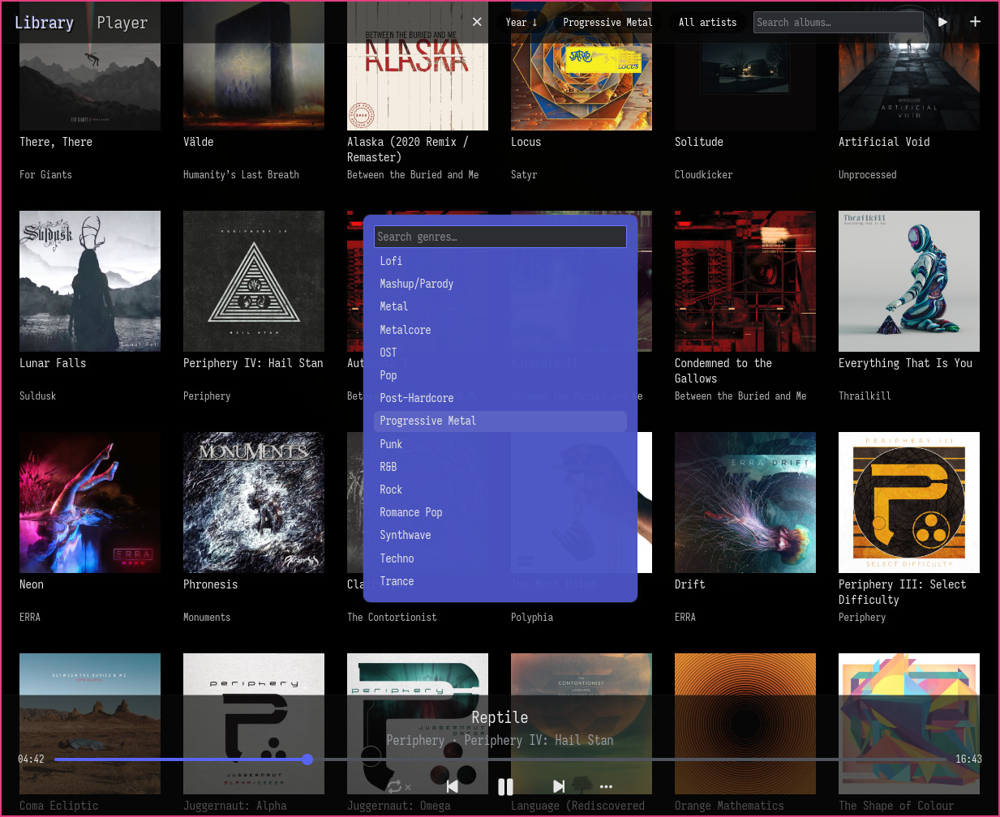
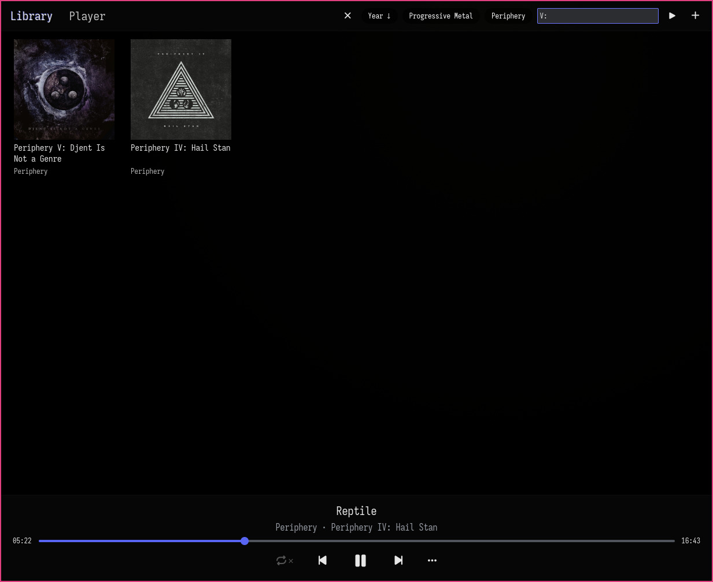
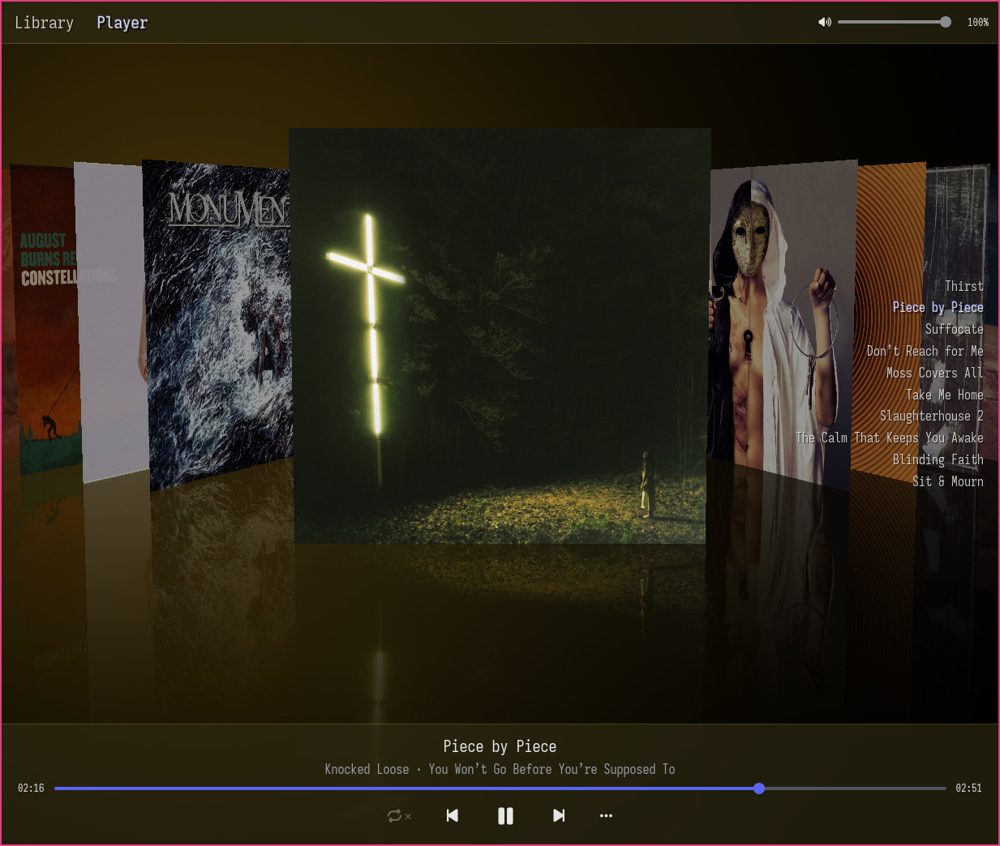
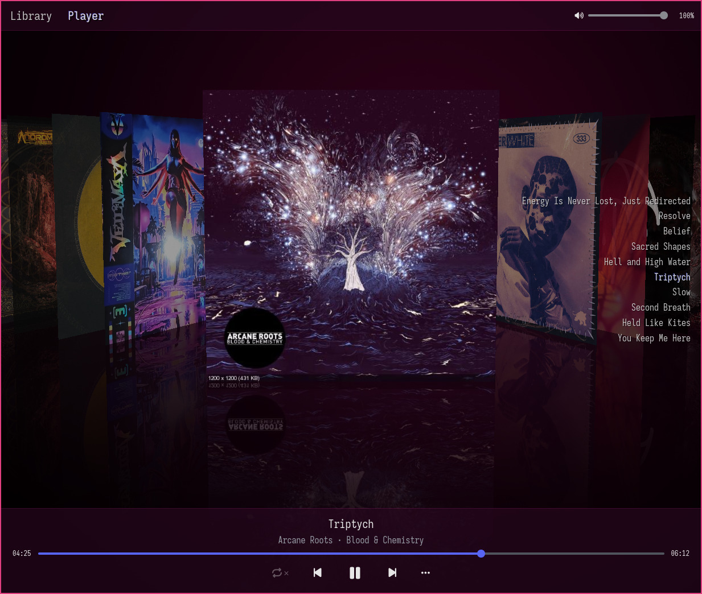
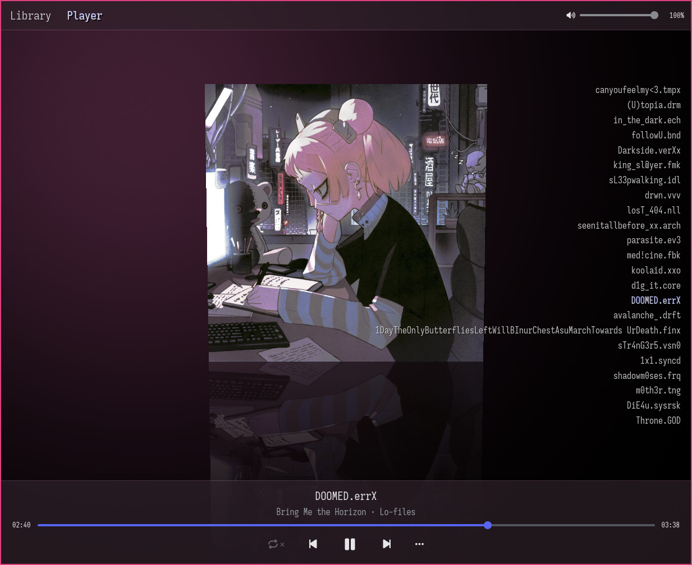

# Phonoscule (graphical player)

The reference application of the [Phonoscule](../README.md) framework:
a music player that arranges your library by its album art,
meant as a lightweight, native alternative to cover-grid MPD clients.

## Features

- **Album-cover library.**
  A grid of cover art you browse by sight.
  Albums are grouped from the files' tags (album artist + album title)
  rather than the directory layout, so a multi-disc album spread across folders is one album,
  and two same-named albums by different artists stay apart.
- **Filtering, search, and sorting.**
  Genre and artist chips, fuzzy album search (just start typing), and a configurable, persisted sort order.
- **Cover Flow now-playing view.**
  The queue's covers on a reflective floor over a backdrop that
  glows with the current cover's colour, the album's track list alongside.
- **Playback.**
  A play queue with album runs, shuffle (by album or track), four repeat modes, seeking,
  and per-application volume driven through the OS mixer.
- **Desktop integration.**
  An MPRIS server (media keys and now-playing), and the session -
  queue, position, sort order - restored across runs.
- **Keyboard-driven.**
  Nearly everything is reachable from the keyboard (see below).

## Formats & platform

- **Audio:** WAV (8/16/24/32-bit integer and 32-bit float, mono or stereo) and Ogg Opus.
- **Cover art:** folder images (`{cover,folder,front,albumart}.{jpg,jpeg,png,webp}`).
- **Output:** PulseAudio, and PipeWire via pipewire-pulse, on Linux.

Not yet: FLAC and Ogg Vorbis and other formats as well as audio output beyond Linux/PulseAudio.

## Configure

The music directory is read from `~/.config/phonoscule.toml`
(or `$XDG_CONFIG_HOME/phonoscule.toml`):

```toml
music-dir = "~/Music"
```

Without a config file it defaults to `~/Music`.
Relative paths resolve against the config file's location.
`~` and environment variables are expanded.

## Run

```sh
cargo run --release -p phonoscule-gui
```

## Install

```sh
# From this directory
cargo install --path .
# Or from the parent directory
cargo install --path gui
```

If `~/.cargo/bin` is in your `$PATH`, you should now be able to launch `phonoscule-gui` from the terminal.

In addition, if you prefer to launch desktop applications through a graphical launcher,
there's a `Phonoscule.desktop` file in this directory which you can copy to e.g. `~/.local/share/applications/`.
The application should then show up in your desktop environment's application launcher.

## Controls

- **Space** - play / pause (from anywhere)
- **Tab / Shift+Tab** - switch between the Library and Player views
- In the Library: **type** to search albums, **Ctrl+F** to focus the search, **Ctrl+W**
  to clear the filters; **Enter** opens an album's track list, and **Ctrl+Enter** /
  **Alt+Enter** play / queue everything currently shown
- On a selected album: **Ctrl+Space** plays it, **Alt+Space** queues it
- In the Player: **←/→** seek, **↑/↓** volume, **Home/End** previous/next track,
  **PageUp/PageDown** previous/next album, **Ctrl+Home/End** jump to the queue's ends
- **Alt+R** cycles the repeat mode; **Ctrl+S** / **Ctrl+Z** shuffle *all* albums / tracks;
  **Alt+S** / **Alt+Z** shuffle *other* albums / tracks;
  **Ctrl+K** clears the queue
- The mouse wheel over the Player scrolls tracks (vertically) or albums (horizontally);
  over the volume bar it sets the volume

## Screenshots

> 
>
> Album-focused browsing in the *Library* view.
> Filter down to a manageable subset or just scroll around.
>
> Play/enqueue all matching albums, or individual albums,
> or **Enter** an individual album to independently play/enqueue one of its tracks.*

> 
>
> Keyboard-friendly modals for filtering by genre and artist.
> Then you can sort the results by year or name, optionally grouped by artist.

> 
> 
> There's of course also a free text input field so can search for albums by name,
> so you can get those really precise results.

> 
> 
>
> The *Player* view lays the queue out as a Cover Flow.
> You can click or scroll or use the keyboard to navigate the queue and playing track.
> Currently album's tracks are listed in an overlay to the right.
> Control this application's volume in the OS volume mixer using the slider in the top right.

> 
>
> We derive an accent color from the album art and use it to draw a nice backdrop glow
> and tint some user interface elements.

## License

Released under the **Mozilla Public License 2.0** (see [`LICENSE`](../LICENSE)).
Copyright (c) 2026 Jojo <jo@jo.zone>.
